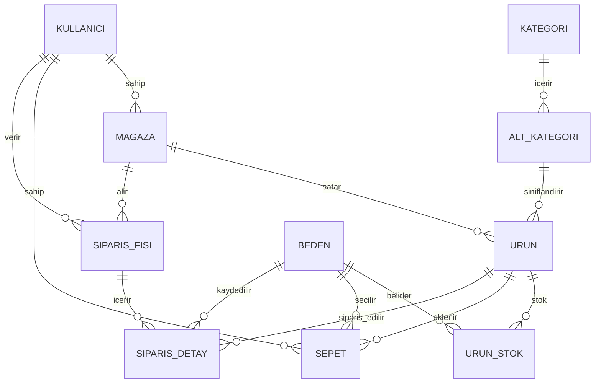

# 🛒 Profesyonel Mağaza E-Ticaret Sistemi

## 📋 Sistem Özeti

### 👥 Roller
| Rol | Yetkiler |
|-----|----------|
| **MÜŞTERİ** | Mağaza gör, ürün filtrele, sepet, sipariş ver, siparişlerimi gör |
| **MAGAZA_SAHIBI** | Ürün ekle/düzenle, sipariş onayla, ciro görüntüle (günlük/aylık/yıllık) |
| **ADMIN** | Kullanıcı yönet, sipariş düzenle, ciro yönetimi, tüm yetkiler |

### 🔄 Müşteri Akışı
```
Giriş/Kayıt → Mağazalar (Mavi, Koton...) → Ürünler (Erkek/Kadın/Çocuk filtre)
    → Ürün Detay (Beden seç) → Sepete Ekle → Sipariş Ver → Siparişlerim
```

### ⚠️ Önemli Kurallar
- Sepete **farklı mağazadan** ürün eklenemez
- Stok bitince "**Tükendi**" gösterilir
- Ciro hesaplama **anlık tarih/saat** ile çalışır

---

## 🗄️ MySQL Veritabanı Şeması (Profesyonel)

```sql
-- =====================================================
-- E-TİCARET VERİTABANI - PROFESYONEl VERSİYON
-- =====================================================

-- 1. KULLANICI
CREATE TABLE kullanici (
    id BIGINT PRIMARY KEY AUTO_INCREMENT,
    kullanici_adi VARCHAR(50) NOT NULL UNIQUE,
    email VARCHAR(100) UNIQUE,
    sifre VARCHAR(255) NOT NULL,
    ad VARCHAR(50),
    soyad VARCHAR(50),
    telefon VARCHAR(20),
    adres TEXT,
    rol ENUM('MUSTERI', 'MAGAZA_SAHIBI', 'ADMIN') NOT NULL DEFAULT 'MUSTERI',
    aktif BOOLEAN DEFAULT TRUE,
    olusturma_tarihi TIMESTAMP DEFAULT CURRENT_TIMESTAMP
);

-- 2. MAGAZA
CREATE TABLE magaza (
    id BIGINT PRIMARY KEY AUTO_INCREMENT,
    sahip_id BIGINT NOT NULL,
    ad VARCHAR(100) NOT NULL,
    aciklama TEXT,
    logo_url VARCHAR(500),
    aktif BOOLEAN DEFAULT TRUE,
    olusturma_tarihi TIMESTAMP DEFAULT CURRENT_TIMESTAMP,
    
    FOREIGN KEY (sahip_id) REFERENCES kullanici(id) ON DELETE CASCADE
);

-- 3. KATEGORİ (Erkek, Kadın, Çocuk)
CREATE TABLE kategori (
    id BIGINT PRIMARY KEY AUTO_INCREMENT,
    ad VARCHAR(50) NOT NULL UNIQUE,  -- Erkek, Kadın, Çocuk
    resim_url VARCHAR(500)
);

-- 4. ALT KATEGORİ (Elbise, Tişört, Pantolon, Kışlık, Yazlık...)
CREATE TABLE alt_kategori (
    id BIGINT PRIMARY KEY AUTO_INCREMENT,
    kategori_id BIGINT NOT NULL,
    ad VARCHAR(50) NOT NULL,  -- Elbise, Tişört, Pantolon, Kazak...
    sezon ENUM('KISLIK', 'YAZLIK', 'MEVSIMLIK') DEFAULT 'MEVSIMLIK',
    
    FOREIGN KEY (kategori_id) REFERENCES kategori(id) ON DELETE CASCADE
);

-- 5. BEDEN
CREATE TABLE beden (
    id BIGINT PRIMARY KEY AUTO_INCREMENT,
    ad VARCHAR(10) NOT NULL UNIQUE  -- XS, S, M, L, XL, XXL
);

-- 6. ÜRÜN
CREATE TABLE urun (
    id BIGINT PRIMARY KEY AUTO_INCREMENT,
    magaza_id BIGINT NOT NULL,
    alt_kategori_id BIGINT NOT NULL,
    ad VARCHAR(200) NOT NULL,
    aciklama TEXT,
    fiyat DECIMAL(10,2) NOT NULL,
    resim_url VARCHAR(500),
    renk VARCHAR(50),
    aktif BOOLEAN DEFAULT TRUE,
    olusturma_tarihi TIMESTAMP DEFAULT CURRENT_TIMESTAMP,
    
    FOREIGN KEY (magaza_id) REFERENCES magaza(id) ON DELETE CASCADE,
    FOREIGN KEY (alt_kategori_id) REFERENCES alt_kategori(id) ON DELETE RESTRICT,
    
    INDEX idx_magaza (magaza_id),
    INDEX idx_kategori (alt_kategori_id)
);

-- 7. ÜRÜN STOK (Beden bazlı stok)
CREATE TABLE urun_stok (
    id BIGINT PRIMARY KEY AUTO_INCREMENT,
    urun_id BIGINT NOT NULL,
    beden_id BIGINT NOT NULL,
    adet INT NOT NULL DEFAULT 0,
    
    FOREIGN KEY (urun_id) REFERENCES urun(id) ON DELETE CASCADE,
    FOREIGN KEY (beden_id) REFERENCES beden(id) ON DELETE RESTRICT,
    
    UNIQUE KEY unique_stok (urun_id, beden_id)
);

-- 8. SEPET
CREATE TABLE sepet (
    id BIGINT PRIMARY KEY AUTO_INCREMENT,
    kullanici_id BIGINT NOT NULL,
    urun_id BIGINT NOT NULL,
    beden_id BIGINT NOT NULL,
    adet INT NOT NULL DEFAULT 1,
    ekleme_tarihi TIMESTAMP DEFAULT CURRENT_TIMESTAMP,
    
    FOREIGN KEY (kullanici_id) REFERENCES kullanici(id) ON DELETE CASCADE,
    FOREIGN KEY (urun_id) REFERENCES urun(id) ON DELETE CASCADE,
    FOREIGN KEY (beden_id) REFERENCES beden(id) ON DELETE RESTRICT,
    
    UNIQUE KEY unique_sepet (kullanici_id, urun_id, beden_id)
);

-- 9. SİPARİŞ FİŞİ
CREATE TABLE siparis_fisi (
    id BIGINT PRIMARY KEY AUTO_INCREMENT,
    kullanici_id BIGINT NOT NULL,
    magaza_id BIGINT NOT NULL,
    toplam_tutar DECIMAL(10,2) NOT NULL,
    teslimat_adresi TEXT NOT NULL,
    durum ENUM('BEKLEMEDE', 'ONAYLANDI', 'HAZIRLANIYOR', 'KARGODA', 'TESLIM_EDILDI', 'IPTAL') DEFAULT 'BEKLEMEDE',
    siparis_tarihi TIMESTAMP DEFAULT CURRENT_TIMESTAMP,
    guncelleme_tarihi TIMESTAMP DEFAULT CURRENT_TIMESTAMP ON UPDATE CURRENT_TIMESTAMP,
    
    FOREIGN KEY (kullanici_id) REFERENCES kullanici(id) ON DELETE RESTRICT,
    FOREIGN KEY (magaza_id) REFERENCES magaza(id) ON DELETE RESTRICT,
    
    INDEX idx_tarih (siparis_tarihi),
    INDEX idx_magaza_tarih (magaza_id, siparis_tarihi)
);

-- 10. SİPARİŞ DETAY
CREATE TABLE siparis_detay (
    id BIGINT PRIMARY KEY AUTO_INCREMENT,
    siparis_fisi_id BIGINT NOT NULL,
    urun_id BIGINT NOT NULL,
    beden_id BIGINT NOT NULL,
    adet INT NOT NULL,
    birim_fiyat DECIMAL(10,2) NOT NULL,
    toplam_fiyat DECIMAL(10,2) NOT NULL,
    
    FOREIGN KEY (siparis_fisi_id) REFERENCES siparis_fisi(id) ON DELETE CASCADE,
    FOREIGN KEY (urun_id) REFERENCES urun(id) ON DELETE RESTRICT,
    FOREIGN KEY (beden_id) REFERENCES beden(id) ON DELETE RESTRICT
);

-- 11. AI ÖNERİ
CREATE TABLE ai_oneri (
    id BIGINT PRIMARY KEY AUTO_INCREMENT,
    kullanici_id BIGINT NOT NULL,
    soru TEXT NOT NULL,
    cevap TEXT NOT NULL,
    tarih TIMESTAMP DEFAULT CURRENT_TIMESTAMP,
    
    FOREIGN KEY (kullanici_id) REFERENCES kullanici(id) ON DELETE CASCADE
);

-- =====================================================
-- ÖRNEK VERİLER
-- =====================================================

-- Kategoriler
INSERT INTO kategori (ad) VALUES ('Erkek'), ('Kadın'), ('Çocuk');

-- Alt Kategoriler
INSERT INTO alt_kategori (kategori_id, ad, sezon) VALUES 
(1, 'Tişört', 'YAZLIK'), (1, 'Gömlek', 'MEVSIMLIK'), (1, 'Kazak', 'KISLIK'), (1, 'Pantolon', 'MEVSIMLIK'),
(2, 'Elbise', 'YAZLIK'), (2, 'Bluz', 'YAZLIK'), (2, 'Etek', 'MEVSIMLIK'), (2, 'Kazak', 'KISLIK'),
(3, 'Tişört', 'YAZLIK'), (3, 'Sweatshirt', 'KISLIK'), (3, 'Pantolon', 'MEVSIMLIK');

-- Bedenler
INSERT INTO beden (ad) VALUES ('XS'), ('S'), ('M'), ('L'), ('XL'), ('XXL');

-- Admin kullanıcı
INSERT INTO kullanici (kullanici_adi, email, sifre, ad, rol) VALUES 
('admin', 'admin@magaza.com', '$2a$10$...', 'Admin', 'ADMIN');
```

---

## 🔗 Tablo İlişkileri



---

## 💰 Ciro Hesaplama Sorguları

```sql
-- GÜNLÜK CİRO (Bugün)
SELECT SUM(toplam_tutar) as gunluk_ciro
FROM siparis_fisi 
WHERE magaza_id = ? 
  AND durum != 'IPTAL'
  AND DATE(siparis_tarihi) = CURDATE();

-- AYLIK CİRO (Bu Ay)
SELECT SUM(toplam_tutar) as aylik_ciro
FROM siparis_fisi 
WHERE magaza_id = ? 
  AND durum != 'IPTAL'
  AND YEAR(siparis_tarihi) = YEAR(CURDATE())
  AND MONTH(siparis_tarihi) = MONTH(CURDATE());

-- YILLIK CİRO (Bu Yıl)
SELECT SUM(toplam_tutar) as yillik_ciro
FROM siparis_fisi 
WHERE magaza_id = ? 
  AND durum != 'IPTAL'
  AND YEAR(siparis_tarihi) = YEAR(CURDATE());

-- GÜNLÜK SİPARİŞ SAYISI
SELECT COUNT(*) as siparis_sayisi
FROM siparis_fisi 
WHERE magaza_id = ? 
  AND DATE(siparis_tarihi) = CURDATE();
```

---

## 📱 Ekran Yapısı

### Müşteri Ekranları
| Ekran | Özellik |
|-------|---------|
| `LoginScreen` | Giriş |
| `RegisterScreen` | Kayıt (Müşteri rolü) |
| `HomeScreen` | Mağaza listesi (Mavi, Koton...) |
| `MagazaScreen` | Ürünler + Erkek/Kadın/Çocuk filtre + Kışlık/Yazlık |
| `UrunDetayScreen` | Resim, açıklama, beden seçimi, fiyat, sepete ekle |
| `SepetScreen` | Sepet, farklı mağaza kontrolü, toplam |
| `SiparislerScreen` | Siparişlerim listesi |
| `SiparisDetayScreen` | Sipariş detay |
| `AiAsistanScreen` | "Ne giymeliyim?" |

### Mağaza Sahibi Ekranları
| Ekran | Özellik |
|-------|---------|
| `SaticiDashboard` | Günlük/Aylık/Yıllık ciro, sipariş sayısı |
| `UrunYonetimScreen` | Ürün listesi, ekle, düzenle, stok güncelle |
| `UrunEkleScreen` | Kategori seç, beden+stok gir |
| `SiparisYonetimScreen` | Gelen siparişler, onayla, düzenle |

### Admin Ekranları
| Ekran | Özellik |
|-------|---------|
| `AdminDashboard` | Toplam ciro, kullanıcı/mağaza sayıları |
| `KullaniciYonetimScreen` | Kullanıcı listele, rol değiştir, sil |
| `SiparisYonetimScreen` | Tüm siparişler, düzenle |
| `MagazaYonetimScreen` | Mağazaları yönet |

---

## 🚀 5 Aşamalı Plan

### AŞAMA 1: Backend Temel (4 saat)
1. Spring Boot projesi oluştur
2. MySQL bağlantısı + application.properties
3. 11 Model sınıfı (Entity)
4. Repository'ler
5. DataSeeder ile örnek veri

### AŞAMA 2: Security + API (3 saat)
1. SecurityConfig + JWT
2. AuthRestController (login, register)
3. MagazaRestController
4. UrunRestController (filtre dahil)
5. SepetRestController (mağaza kontrolü)
6. SiparisRestController

### AŞAMA 3: Mağaza Sahibi + Ciro (2 saat)
1. SaticiRestController
2. Ciro hesaplama servisi
3. Stok yönetimi
4. Sipariş onaylama

### AŞAMA 4: React Native (6 saat)
1. Proje kurulum + navigation
2. Auth ekranları
3. Müşteri ekranları
4. Mağaza sahibi paneli
5. Admin paneli

### AŞAMA 5: AI + Deploy (2 saat)
1. OpenAI entegrasyonu
2. AWS deploy

---

> [!IMPORTANT]
> **Sepet Kontrolü:** Kullanıcının sepetinde ürün varsa ve farklı mağazadan eklemeye çalışırsa → "Sepetinizde başka mağazadan ürün var. Önce sepeti boşaltın." hatası

> [!TIP]
> Projenin en güçlü yönü: **Beden bazlı stok takibi** + **Ciro raporlama sistemi**
